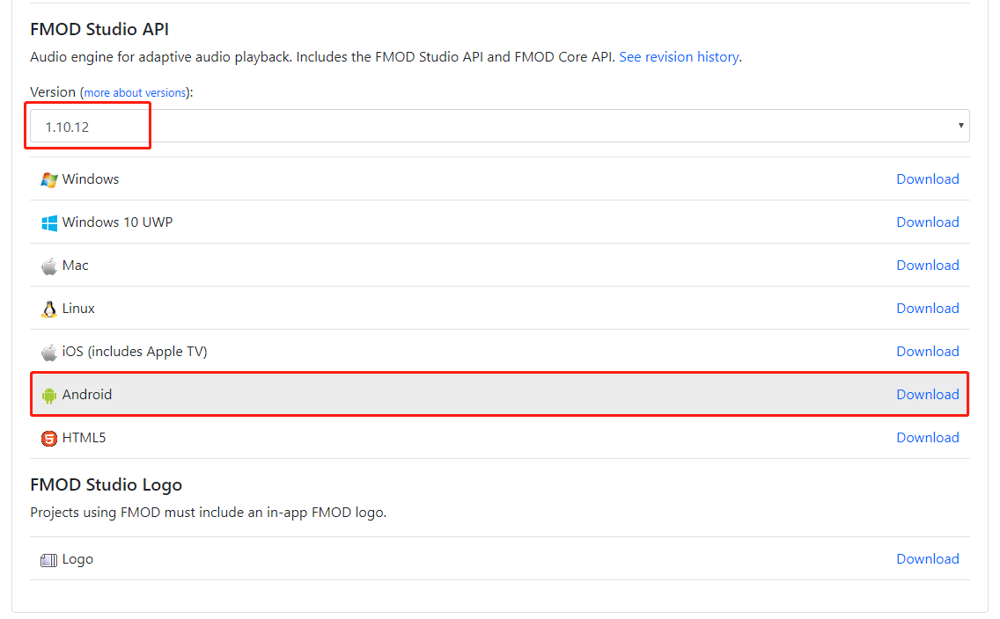
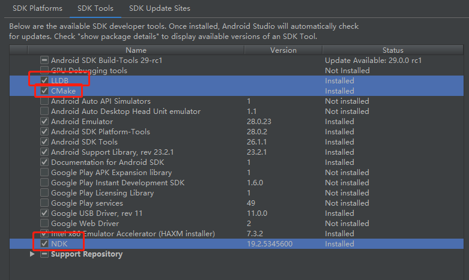
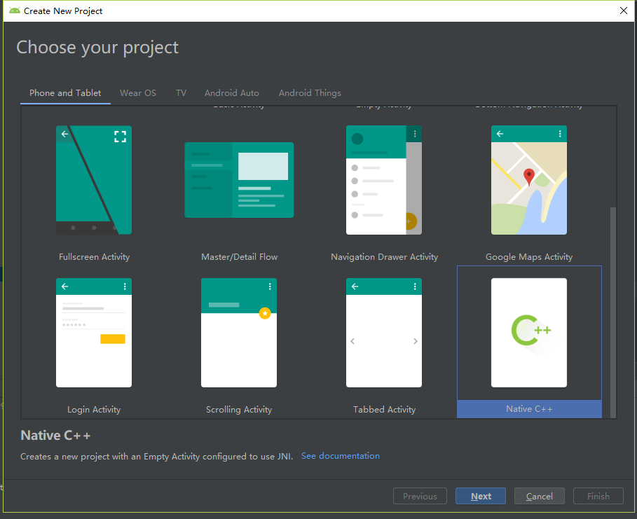
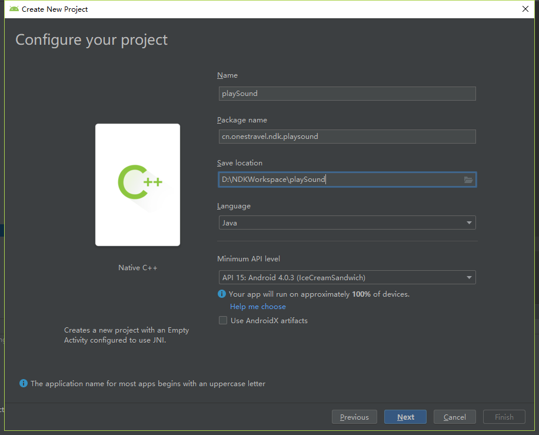

# AndroidStudio下集成Fmod，实现仿QQ变声效果
## 前言
**在使用QQ的时候，我们会发现有一个炫酷的功能，那就是变声，效果图如下;其实QQ变声效果就是使用了Fmod声音引擎，通过NDK的开发，来实现对声音的变换。今天我们先进行一下QQ变声效果的前期实现，先引入Fmod库，实现音频文件的播放**


## 一、前期准备
- **[【Fmod下载】](https://www.fmod.com/download)**：点击该连接后，进行注册，登录以后再下载,选择版本

- **【Android Studio】**：Android Studio实现NDK支持


## 二、实现使用fmod播放assets下的音频
### 1、创建一个支持C++的Android项目






**创建好之后会在app/src/main 下面看到cpp文件夹，这就是进行NDK开发的C/C++层的文件夹**

### 2、配置Android项目
 - 在 app/src/main 下创建 jniLibs 文件夹
 - 将下载好的fmod包打开，进入到 api/lowlevel/ 下，可以看到 examples 、inc 、lib 三个文件夹
 - 将 inc 文件夹整体复制到 src/main/cpp 目录下
 - 将 lib 文件夹下的 fmod.jar 复制到 libs 目录下，并且右键该jar包，Add As Library 
 - 将 lib 文件夹下的 so 动态库的不同平台的文件夹复制到 刚刚创建好的 jniLibs 目录下
 - 将 examples 目录下的common.h,common.cpp,common_platform.h,common_platform.cpp,play_sound.cpp 文件复制到src/main/cpp 目录下
 - 修改common.h中 #include "fmod.h" 为 #include "inc/fmod.h"
 - 修改common.cpp中 #include "fmod_errors.h" 为 #include "inc/fmod_errors.h"
 - 修改play_sound.cpp中 #include "fmod.hpp" 为 #include "inc/fmod.hpp"
 - 将 examples/java 下的org文件夹整个赋值到 src/main/java 目录下，并修改 AndroidManifest.xml 中的启动类为  org.fmod.example.MainActivity
 - 在app下的build.gradle 中的 defaultConfig 木块中新增 NDK 配置
 ```
    ndk {
            abiFilters "armeabi-v7a", "arm64-v8a", "x86", "x86_64"
        }
```
 - 将引入的so动态库和play_sound.cpp等加入到 CMakeLists.txt 文件中，具体配置如下：
```
cmake_minimum_required(VERSION 3.4.1)

set(distribution_DIR ${PROJECT_SOURCE_DIR}../../jniLibs)
include_directories(src/main/cpp/inc)
add_library( sound
        SHARED
        play_sound.cpp
        common.cpp
        common_platform.cpp)
add_library( fmod
        SHARED
        IMPORTED )
set_target_properties( fmod
        PROPERTIES IMPORTED_LOCATION
        ${distribution_DIR}/${ANDROID_ABI}/libfmod.so)
add_library( fmodL
        SHARED
        IMPORTED )
set_target_properties( fmodL
        PROPERTIES IMPORTED_LOCATION
        ${distribution_DIR}/${ANDROID_ABI}/libfmodL.so )
find_library( # Sets the name of the path variable.
        log-lib
        log)
target_link_libraries( sound
        fmod
        fmodL
        ${log-lib} )

```
 - 修改 org.fmod.example.MainActivity 中的static 方法,删除一些未引入的library，更改刚刚在 CMakeLists.txt 文件中定义的library 如下：
 ```
 static {
        try {
            System.loadLibrary("fmodL");
        } catch (UnsatisfiedLinkError e) {
        }
        try {
            System.loadLibrary("fmod");
        } catch (UnsatisfiedLinkError e) {
        }
        System.loadLibrary("sound");
    }
 ```
 - 将 examples/media 文件夹下的音频资源文件复制到项目的 assets 目录下，具体文件引入可查看 play_sound.cpp 文件42~52行；这里将所有后缀为 .wav 和 .mp3 的文件都复制到 assets 目录下。
 ```
    result = system->createSound(Common_MediaPath("drumloop.wav"), FMOD_DEFAULT, 0, &sound1);
    ERRCHECK(result);

    result = sound1->setMode(FMOD_LOOP_OFF);    /* drumloop.wav has embedded loop points which automatically makes looping turn on, */
    ERRCHECK(result);                           /* so turn it off here.  We could have also just put FMOD_LOOP_OFF in the above CreateSound call. */

    result = system->createSound(Common_MediaPath("jaguar.wav"), FMOD_DEFAULT, 0, &sound2);
    ERRCHECK(result);

    result = system->createSound(Common_MediaPath("swish.wav"), FMOD_DEFAULT, 0, &sound3);
    ERRCHECK(result);
```
 - 到这里，我们所有的步骤都已经完成了，可以成功运行项目了，项目运行起来后，我们可以看到界面上加载了三首音频文件，分别对应 A , B , C 三个按钮，我们点击这三个按钮，就可以播放对应的音频文件
 

## 三、项目改造
**第二部的操作是完全使用了 fmod 的示例来完成 assets 目录下的音频文件的播放，我们可以看到这个是使用的 org.fmod.example.MainActivity 进行播放的，我们接下来将播放的 native 方法抽取成一个 utils 类，然后再自己的MainActivity中调用（使用org.fmod.example.MainActivity的布局）；然后再添加点击 D 和 E 按钮时播放音频文件的功能**

### 1、抽取 FmodUtils.java 工具类，使用自己包路径下的 MainActivity 实现播放
#### 1.1 FmodUtils.java 类如下，在原有main()方法加了参数，传入Activity实例：
```
package org.fmod.core;

import android.app.Activity;

/**
 * @author onestravel
 * @version 1.0.0
 * @name org.fmod.example.FmodUtils
 * @description //TODO
 */
public class FmodUtils {
    private static FmodUtils mInstance;

    private FmodUtils() {

    }

    public static FmodUtils getInstance() {
        synchronized (FmodUtils.class) {
            if (mInstance == null) {
                mInstance = new FmodUtils();
            }
        }
        return mInstance;
    }


    public native String getButtonLabel(int index);
    public native void buttonDown(int index);
    public native void buttonUp(int index);
    public native void setStateCreate();
    public native void setStateStart();
    public native void setStateStop();
    public native void setStateDestroy();
    public native void main(Activity context);

    static
    {
        try { 
            System.loadLibrary("fmodL");
        }
        catch (UnsatisfiedLinkError e) { }
        try { 
            System.loadLibrary("fmod");
        }
        catch (UnsatisfiedLinkError e) { }

        System.loadLibrary("sound");
    }
}

```
#### 1.2 更改cpp 文件中的 native 函数
**更改 common_platform.cpp 文件中对应的 native 函数名称(154~200行)**
```
/*==============================================================================
FMOD Example Framework
Copyright (c), Firelight Technologies Pty, Ltd 2013-2019.
==============================================================================*/
#include "common.h"
#include <string.h>
#include <jni.h>
#include <unistd.h>
#include <string>
#include <vector>

JNIEnv *gJNIEnv;
jobject gMainActivityObject;
int gDownButtons;
int gLastDownButtons;
int gPressedButtons;
bool gSuspendState;
bool gQuitState;
std::string gUIString;
std::vector<char *> gPathList;

int FMOD_Main(); // Defined in example

void Common_Init(void **extraDriverData)
{
	gDownButtons = 0;
	gLastDownButtons = 0;
	gPressedButtons = 0;
	gSuspendState = false;
	gQuitState = false;
}

void Common_Close()
{
    for (std::vector<char *>::iterator item = gPathList.begin(); item != gPathList.end(); ++item)
    {
        free(*item);
    }

    gPathList.clear();
}

void Common_Update()
{
	jstring text = gJNIEnv->NewStringUTF(gUIString.c_str());
	jclass mainActivityClass = gJNIEnv->GetObjectClass(gMainActivityObject);
    jmethodID updateScreenMethodID = gJNIEnv->GetMethodID(mainActivityClass, "updateScreen", "(Ljava/lang/String;)V");

    gJNIEnv->CallVoidMethod(gMainActivityObject, updateScreenMethodID, text);

    gJNIEnv->DeleteLocalRef(text);
    gJNIEnv->DeleteLocalRef(mainActivityClass);

    gUIString.clear();

    gPressedButtons = (gLastDownButtons ^ gDownButtons) & gDownButtons;
    gLastDownButtons = gDownButtons;

    if (gQuitState)
    {
    	gPressedButtons |= (1 << BTN_QUIT);
    }
}

void Common_Sleep(unsigned int ms)
{
    usleep(ms * 1000);
}

void Common_Exit(int returnCode)
{
    exit(returnCode);
}

void Common_DrawText(const char *text)
{
    char s[256];
    snprintf(s, sizeof(s), "%s\n", text);
    
    gUIString.append(s);
}

void Common_LoadFileMemory(const char *name, void **buff, int *length)
{
    FILE *file = fopen(name, "rb");
    
    fseek(file, 0, SEEK_END);
    long len = ftell(file);
    fseek(file, 0, SEEK_SET);
    
    void *mem = malloc(len);
    fread(mem, 1, len, file);
    
    fclose(file);

    *buff = mem;
    *length = len;
}

void Common_UnloadFileMemory(void *buff)
{
    free(buff);
}

bool Common_BtnPress(Common_Button btn)
{
    return ((gPressedButtons & (1 << btn)) != 0);
}

bool Common_BtnDown(Common_Button btn)
{
    return ((gDownButtons & (1 << btn)) != 0);
}

const char *Common_BtnStr(Common_Button btn)
{
    switch (btn)
    {
        case BTN_ACTION1: return "A";
        case BTN_ACTION2: return "B";
        case BTN_ACTION3: return "C";
        case BTN_ACTION4: return "D";
        case BTN_UP:      return "Up";
        case BTN_DOWN:    return "Down";
        case BTN_LEFT:    return "Left";
        case BTN_RIGHT:   return "Right";
        case BTN_MORE:    return "E";
        case BTN_QUIT:    return "Back";
        default:          return "Unknown";
    }
}

const char *Common_MediaPath(const char *fileName)
{
    char *filePath = (char *)calloc(256, sizeof(char));

    strcat(filePath, "file:///android_asset/");
    strcat(filePath, fileName);
    gPathList.push_back(filePath);

    return filePath;
}

const char *Common_WritePath(const char *fileName)
{
	return Common_MediaPath(fileName);
}

bool Common_SuspendState()
{
	return gSuspendState;
}

extern "C"
{

jstring Java_org_fmod_core_FmodUtils_getButtonLabel(JNIEnv *env, jobject thiz, jint index)
{
    return env->NewStringUTF(Common_BtnStr((Common_Button)index));
}

void Java_org_fmod_core_FmodUtils_buttonDown(JNIEnv *env, jobject thiz, jint index)
{
    gDownButtons |= (1 << index);
}

void Java_org_fmod_core_FmodUtils_buttonUp(JNIEnv *env, jobject thiz, jint index)
{
    gDownButtons &= ~(1 << index);
}

void Java_org_fmod_core_FmodUtils_setStateCreate(JNIEnv *env, jobject thiz)
{

}

void Java_org_fmod_core_FmodUtils_setStateStart(JNIEnv *env, jobject thiz)
{
	gSuspendState = false;
}

void Java_org_fmod_core_FmodUtils_setStateStop(JNIEnv *env, jobject thiz)
{
	gSuspendState = true;
}

void Java_org_fmod_core_FmodUtils_setStateDestroy(JNIEnv *env, jobject thiz)
{
	gQuitState = true;
}

void Java_org_fmod_core_FmodUtils_main(JNIEnv *env, jobject thiz,jobject act)
{
	gJNIEnv = env;
	gMainActivityObject = act;

	FMOD_Main();
}

} /* extern "C" */

```

#### 1.3 替换MainActivity
**将 org.fmod.example.MainActivity 复制到自己的包路径下 ， 删除文件中 native 方法和 static 方法，新增 mFmodUtils 成员变量，并实例化，将调用 native 方法的地方都改成 mFmodUtils 实例下的方法，注意 main() 方法需要传当前 Activity 进去**

```
public class MainActivity extends Activity implements OnTouchListener, Runnable {
    private TextView mTxtScreen;
    private Thread mThread;
    private FmodUtils mFmodUtils;

    @Override
    protected void onCreate(Bundle savedInstanceState) {
        super.onCreate(savedInstanceState);
        mFmodUtils = FmodUtils.getInstance();
        // Create the text area
        mTxtScreen = new TextView(this);
        mTxtScreen.setTextSize(TypedValue.COMPLEX_UNIT_SP, 10.0f);
        mTxtScreen.setTypeface(Typeface.MONOSPACE);

        // Create the buttons
        Button[] buttons = new Button[9];
        for (int i = 0; i < buttons.length; i++) {
            buttons[i] = new Button(this);
            buttons[i].setText(mFmodUtils.getButtonLabel(i));
            buttons[i].setOnTouchListener(this);
            buttons[i].setId(i);
        }

        // Create the button row layouts
        LinearLayout llTopRowButtons = new LinearLayout(this);
        llTopRowButtons.setOrientation(LinearLayout.HORIZONTAL);
        LinearLayout llMiddleRowButtons = new LinearLayout(this);
        llMiddleRowButtons.setOrientation(LinearLayout.HORIZONTAL);
        LinearLayout llBottomRowButtons = new LinearLayout(this);
        llBottomRowButtons.setOrientation(LinearLayout.HORIZONTAL);

        // Create the main view layout
        LinearLayout llView = new LinearLayout(this);
        llView.setOrientation(LinearLayout.VERTICAL);

        // Create layout parameters
        LayoutParams lpLayout = new LayoutParams(LayoutParams.MATCH_PARENT, LayoutParams.MATCH_PARENT, 1.0f);

        // Set up the view hierarchy
        llTopRowButtons.addView(buttons[0], lpLayout);
        llTopRowButtons.addView(buttons[6], lpLayout);
        llTopRowButtons.addView(buttons[1], lpLayout);
        llMiddleRowButtons.addView(buttons[4], lpLayout);
        llMiddleRowButtons.addView(buttons[8], lpLayout);
        llMiddleRowButtons.addView(buttons[5], lpLayout);
        llBottomRowButtons.addView(buttons[2], lpLayout);
        llBottomRowButtons.addView(buttons[7], lpLayout);
        llBottomRowButtons.addView(buttons[3], lpLayout);
        llView.addView(mTxtScreen, lpLayout);
        llView.addView(llTopRowButtons);
        llView.addView(llMiddleRowButtons);
        llView.addView(llBottomRowButtons);

        setContentView(llView);

        // Request necessary permissions
        if (Build.VERSION.SDK_INT >= Build.VERSION_CODES.M) {
            String[] perms = {"android.permission.RECORD_AUDIO", "android.permission.WRITE_EXTERNAL_STORAGE"};
            if (checkSelfPermission(perms[0]) == PackageManager.PERMISSION_DENIED ||
                    checkSelfPermission(perms[1]) == PackageManager.PERMISSION_DENIED) {
                requestPermissions(perms, 200);
            }
        }

        org.fmod.FMOD.init(this);

        mThread = new Thread(this, "Example Main");
        mThread.start();

        mFmodUtils.setStateCreate();
    }

    @Override
    protected void onStart() {
        super.onStart();
        mFmodUtils.setStateStart();
    }

    @Override
    protected void onStop() {
        mFmodUtils.setStateStop();
        super.onStop();
    }

    @Override
    protected void onDestroy() {
        mFmodUtils.setStateDestroy();

        try {
            mThread.join();
        } catch (InterruptedException e) {
        }

        org.fmod.FMOD.close();

        super.onDestroy();
    }

    @Override
    public boolean onTouch(View view, MotionEvent motionEvent) {
        if (motionEvent.getAction() == MotionEvent.ACTION_DOWN) {
            mFmodUtils.buttonDown(view.getId());
        } else if (motionEvent.getAction() == MotionEvent.ACTION_UP) {
            mFmodUtils.buttonUp(view.getId());
        }

        return true;
    }

    @Override
    public void run() {
        mFmodUtils.main(this);
    }

    public void updateScreen(final String text) {
        runOnUiThread(new Runnable() {
            @Override
            public void run() {
                mTxtScreen.setText(text);
            }
        });
    }


}

```

#### 1.4 更改AndroidManifest
**更改 AndroidManifest.xml 文件中的启动页的 Activity 为自己包路径下的 MainActivity ，删除fmod 示例的 MainActivity ,就可以运行成功了**

### 2、实现按钮 D 和 E 播放音频
**我们使用 singing.wav 和 wave.mp3 来实现 D 和 E 按钮播放音频的功能**
#### 2.1 加载音频文件
**在play_sound.cpp 中的 FMOD_Main() 函数中的do...while前，定义 sound4 和 sound5 变量，然后使用这两个变量加载对应的音频文件**
```
    FMOD::System     *system;
    // 新增属性 sound4 和 sound5
    FMOD::Sound      *sound1, *sound2, *sound3, *sound4, *sound5;
    FMOD::Channel    *channel = 0;
    FMOD_RESULT       result;
    unsigned int      version;
    void             *extradriverdata = 0;
    
    Common_Init(&extradriverdata);

    /*
        Create a System object and initialize
    */
    result = FMOD::System_Create(&system);
    ERRCHECK(result);

    result = system->getVersion(&version);
    ERRCHECK(result);

    if (version < FMOD_VERSION)
    {
        Common_Fatal("FMOD lib version %08x doesn't match header version %08x", version, FMOD_VERSION);
    }

    result = system->init(32, FMOD_INIT_NORMAL, extradriverdata);
    ERRCHECK(result);

    result = system->createSound(Common_MediaPath("drumloop.wav"), FMOD_DEFAULT, 0, &sound1);
    ERRCHECK(result);

    result = sound1->setMode(FMOD_LOOP_OFF);    /* drumloop.wav has embedded loop points which automatically makes looping turn on, */
    ERRCHECK(result);                           /* so turn it off here.  We could have also just put FMOD_LOOP_OFF in the above CreateSound call. */

    result = system->createSound(Common_MediaPath("jaguar.wav"), FMOD_DEFAULT, 0, &sound2);
    ERRCHECK(result);

    result = system->createSound(Common_MediaPath("swish.wav"), FMOD_DEFAULT, 0, &sound3);
    ERRCHECK(result);

    //为sound4 加载音频文件singing.wav
    result = system->createSound(Common_MediaPath("singing.wav"), FMOD_DEFAULT, 0, &sound4);
    ERRCHECK(result);

    //为sound5 加载音频文件wave.mp3
    result = system->createSound(Common_MediaPath("wave.mp3"), FMOD_DEFAULT, 0, &sound5);
    ERRCHECK(result);
```

#### 2.2 将音频播放与按钮事件关联
**在play_sound.cpp 中的 FMOD_Main() 函数中的do...while的{}中，处理 D 和 E 按钮的事件，播放sound4 和 sound 5 , 按钮的事件类型可在 common_platform.cpp 中的 Common_BtnStr 函数中查看**

Common_BtnStr 函数

```
const char *Common_BtnStr(Common_Button btn)
{
    switch (btn)
    {
        case BTN_ACTION1: return "A";
        case BTN_ACTION2: return "B";
        case BTN_ACTION3: return "C";
        case BTN_ACTION4: return "D";
        case BTN_UP:      return "Up";
        case BTN_DOWN:    return "Down";
        case BTN_LEFT:    return "Left";
        case BTN_RIGHT:   return "Right";
        case BTN_MORE:    return "E";
        case BTN_QUIT:    return "Back";
        default:          return "Unknown";
    }
}

```

处理 D 和 E 按钮的事件，播放音频

```
        //处理按钮 D 的事件，播放 sound4
        if (Common_BtnPress(BTN_ACTION4))
        {
            result = system->playSound(sound4, 0, false, &channel);
            ERRCHECK(result);
        }

        //处理按钮 E 的事件，播放 sound5
        if (Common_BtnPress(BTN_MORE))
        {
            result = system->playSound(sound5, 0, false, &channel);
            ERRCHECK(result);
        }
```

#### 2.3 释放 sound4 和 sound5
**在do...while 执行之后，释放加载了对应音频文件的属性**
```
/*
        Shut down
    */
    result = sound1->release();
    ERRCHECK(result);
    result = sound2->release();
    ERRCHECK(result);
    result = sound3->release();
    ERRCHECK(result);
    
    //释放sound4
    result = sound4->release();
    ERRCHECK(result);
    //释放sound5
    result = sound5->release();
    ERRCHECK(result);
    
    result = system->close();
    ERRCHECK(result);
    result = system->release();
    ERRCHECK(result);

    Common_Close();
```

#### 2.4 play_sound.cpp 完整代码
**更改完成之后，按钮D 和 E 播放音频的功能实现了，点击运行就可以了，下面贴上play_sound.cpp的完整代码**
```
/*==============================================================================
Play Sound Example
Copyright (c), Firelight Technologies Pty, Ltd 2004-2019.

This example shows how to simply load and play multiple sounds, the simplest 
usage of FMOD. By default FMOD will decode the entire file into memory when it
loads. If the sounds are big and possibly take up a lot of RAM it would be
better to use the FMOD_CREATESTREAM flag, this will stream the file in realtime
as it plays.
==============================================================================*/
#include "inc/fmod.hpp"
#include "common.h"

int FMOD_Main()
{
    FMOD::System     *system;
    // 新增属性 sound4 和 sound5
    FMOD::Sound      *sound1, *sound2, *sound3, *sound4, *sound5;
    FMOD::Channel    *channel = 0;
    FMOD_RESULT       result;
    unsigned int      version;
    void             *extradriverdata = 0;
    
    Common_Init(&extradriverdata);

    /*
        Create a System object and initialize
    */
    result = FMOD::System_Create(&system);
    ERRCHECK(result);

    result = system->getVersion(&version);
    ERRCHECK(result);

    if (version < FMOD_VERSION)
    {
        Common_Fatal("FMOD lib version %08x doesn't match header version %08x", version, FMOD_VERSION);
    }

    result = system->init(32, FMOD_INIT_NORMAL, extradriverdata);
    ERRCHECK(result);

    result = system->createSound(Common_MediaPath("drumloop.wav"), FMOD_DEFAULT, 0, &sound1);
    ERRCHECK(result);

    result = sound1->setMode(FMOD_LOOP_OFF);    /* drumloop.wav has embedded loop points which automatically makes looping turn on, */
    ERRCHECK(result);                           /* so turn it off here.  We could have also just put FMOD_LOOP_OFF in the above CreateSound call. */

    result = system->createSound(Common_MediaPath("jaguar.wav"), FMOD_DEFAULT, 0, &sound2);
    ERRCHECK(result);

    result = system->createSound(Common_MediaPath("swish.wav"), FMOD_DEFAULT, 0, &sound3);
    ERRCHECK(result);

    //为sound4 加载音频文件singing.wav
    result = system->createSound(Common_MediaPath("singing.wav"), FMOD_DEFAULT, 0, &sound4);
    ERRCHECK(result);

    //为sound5 加载音频文件wave.mp3
    result = system->createSound(Common_MediaPath("wave.mp3"), FMOD_DEFAULT, 0, &sound5);
    ERRCHECK(result);

    /*
        Main loop
    */
    do
    {
        Common_Update();

        if (Common_BtnPress(BTN_ACTION1))
        {
            result = system->playSound(sound1, 0, false, &channel);
            ERRCHECK(result);
        }

        if (Common_BtnPress(BTN_ACTION2))
        {
            result = system->playSound(sound2, 0, false, &channel);
            ERRCHECK(result);
        }

        if (Common_BtnPress(BTN_ACTION3))
        {
            result = system->playSound(sound3, 0, false, &channel);
            ERRCHECK(result);
        }

        //处理按钮 D 的事件，播放 sound4
        if (Common_BtnPress(BTN_ACTION4))
        {
            result = system->playSound(sound4, 0, false, &channel);
            ERRCHECK(result);
        }

        //处理按钮 E 的事件，播放 sound5
        if (Common_BtnPress(BTN_MORE))
        {
            result = system->playSound(sound5, 0, false, &channel);
            ERRCHECK(result);
        }

        result = system->update();
        ERRCHECK(result);

        {
            unsigned int ms = 0;
            unsigned int lenms = 0;
            bool         playing = 0;
            bool         paused = 0;
            int          channelsplaying = 0;

            if (channel)
            {
                FMOD::Sound *currentsound = 0;

                result = channel->isPlaying(&playing);
                if ((result != FMOD_OK) && (result != FMOD_ERR_INVALID_HANDLE) && (result != FMOD_ERR_CHANNEL_STOLEN))
                {
                    ERRCHECK(result);
                }

                result = channel->getPaused(&paused);
                if ((result != FMOD_OK) && (result != FMOD_ERR_INVALID_HANDLE) && (result != FMOD_ERR_CHANNEL_STOLEN))
                {
                    ERRCHECK(result);
                }

                result = channel->getPosition(&ms, FMOD_TIMEUNIT_MS);
                if ((result != FMOD_OK) && (result != FMOD_ERR_INVALID_HANDLE) && (result != FMOD_ERR_CHANNEL_STOLEN))
                {
                    ERRCHECK(result);
                }
               
                channel->getCurrentSound(&currentsound);
                if (currentsound)
                {
                    result = currentsound->getLength(&lenms, FMOD_TIMEUNIT_MS);
                    if ((result != FMOD_OK) && (result != FMOD_ERR_INVALID_HANDLE) && (result != FMOD_ERR_CHANNEL_STOLEN))
                    {
                        ERRCHECK(result);
                    }
                }
            }

            system->getChannelsPlaying(&channelsplaying, NULL);

            Common_Draw("==================================================");
            Common_Draw("Play Sound Example.");
            Common_Draw("Copyright (c) Firelight Technologies 2004-2019.");
            Common_Draw("==================================================");
            Common_Draw("");
            Common_Draw("Press %s to play a mono sound (drumloop)", Common_BtnStr(BTN_ACTION1));
            Common_Draw("Press %s to play a mono sound (jaguar)", Common_BtnStr(BTN_ACTION2));
            Common_Draw("Press %s to play a stereo sound (swish)", Common_BtnStr(BTN_ACTION3));
            Common_Draw("Press %s to quit", Common_BtnStr(BTN_QUIT));
            Common_Draw("");
            Common_Draw("Time %02d:%02d:%02d/%02d:%02d:%02d : %s", ms / 1000 / 60, ms / 1000 % 60, ms / 10 % 100, lenms / 1000 / 60, lenms / 1000 % 60, lenms / 10 % 100, paused ? "Paused " : playing ? "Playing" : "Stopped");
            Common_Draw("Channels Playing %d", channelsplaying);
        }

        Common_Sleep(50);
    } while (!Common_BtnPress(BTN_QUIT));

    /*
        Shut down
    */
    result = sound1->release();
    ERRCHECK(result);
    result = sound2->release();
    ERRCHECK(result);
    result = sound3->release();
    ERRCHECK(result);

    //释放sound4
    result = sound4->release();
    ERRCHECK(result);
    //释放sound5
    result = sound5->release();
    ERRCHECK(result);

    result = system->close();
    ERRCHECK(result);
    result = system->release();
    ERRCHECK(result);

    Common_Close();

    return 0;
}

```

**到此，我们实现集成 fmod 的音频播放功能已经实现，也实现了其他按钮播放音频文件的功能，这是实现模拟QQ变声项目的前期准备，后面我们会继续实现QQ变声功能。**